游戏的镜头设计是大学问
# 1 镜头应该服务于玩法
比如广视角能带来充沛的外围视野，而高倍放大镜头则能让你精准瞄准。
在2D视角下，判断角色之间的距离很容易
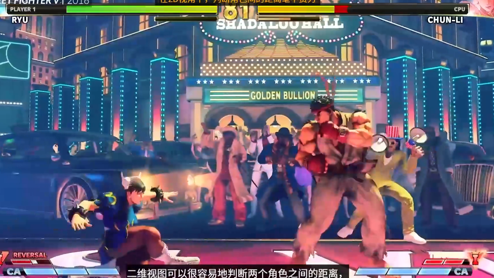
，3D反而复杂
线性流程游戏也许青睐强制轨道摄像机，而探索式游戏需要玩家控制的自由视角
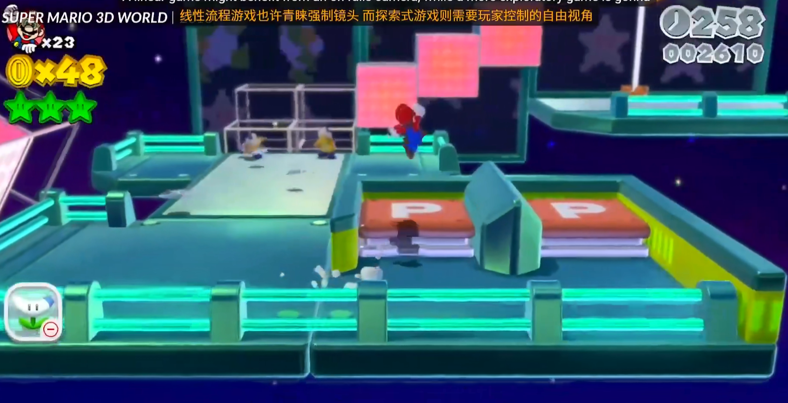
# 2 镜头也能服务于美学

一个超广角镜头会让角色显得渺小卑微
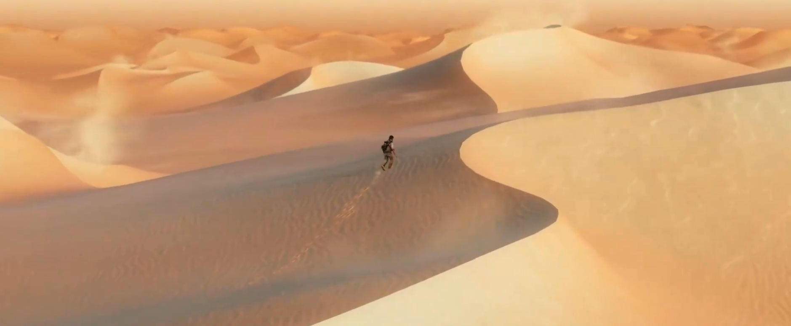
，而一个近身特写则可能唤起你的幽闭恐惧
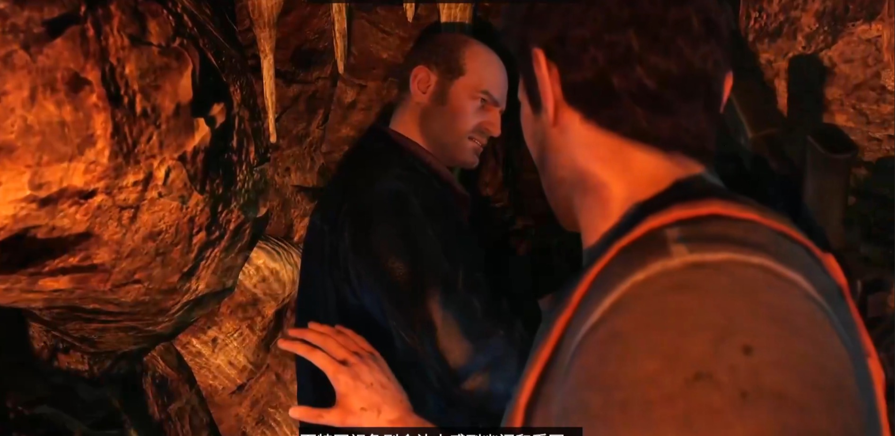
第一人称视角带来沉浸感，让你感觉自己代入了角色

而上帝视角则给你神的感觉
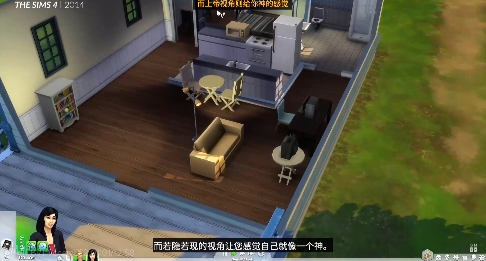
正如电影那样，不同视角能表达不同氛围、情绪和画面张力，所以开发者可以巧妙运镜来营造特定效果。在《旺达与巨像》中，当玩家骑马时，镜头会偏向一侧，让画面符合“三分构图法”-主体偏离画面中心。
开发者也可以彻底把控镜头来导演场景。在《生化危机》中，整个游戏都是静态预渲染背景视角，仿佛是通过几个监控摄像头在观察
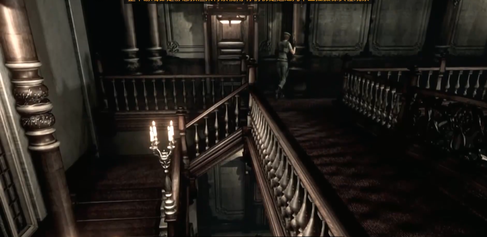
，这确实让开发者充分把控演出风格。《生化危机2》中的舔食者是如何引入的
### 0.1 第一个镜头 - 两面墙形成引导线将玩家的视线引向窗户
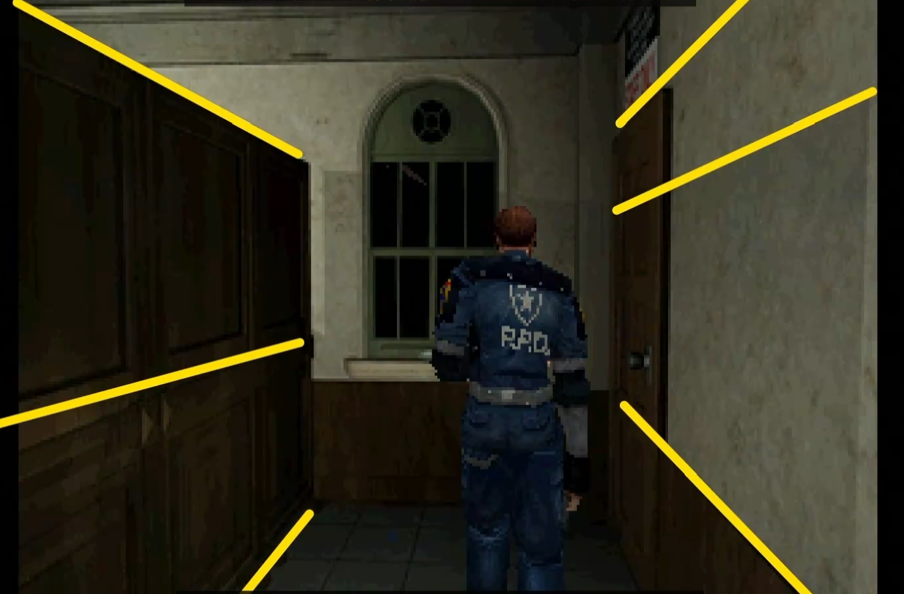
另一个镜头摄像机被摆在窗外某物的角度

然后一个高视角，玩家看起来渺小
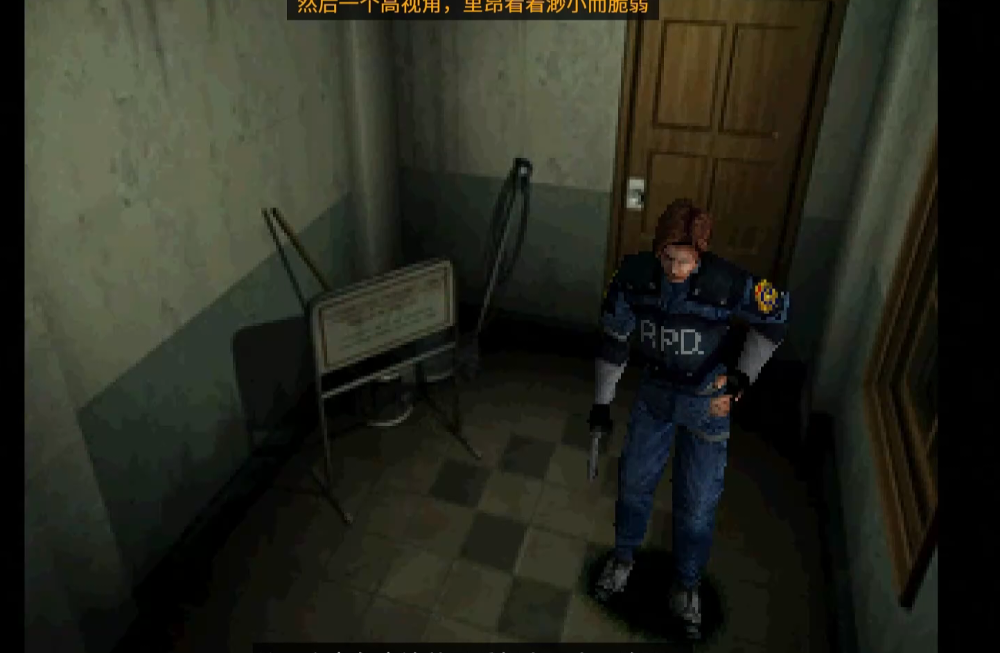
接下来玩家必须跑向镜头，然后拐入盲角
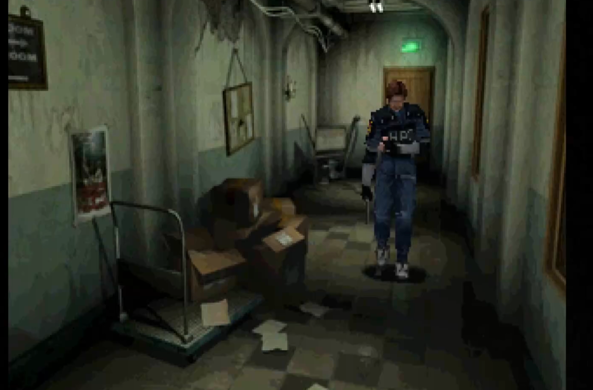这样玩家就无法看到前方威胁
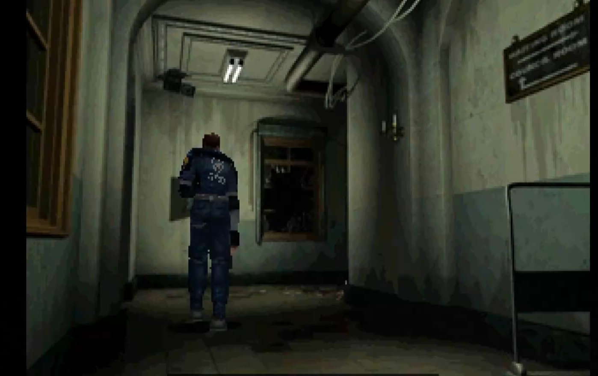
然后镜头框住破窗和无头丧尸，再次遮住玩家前方视线
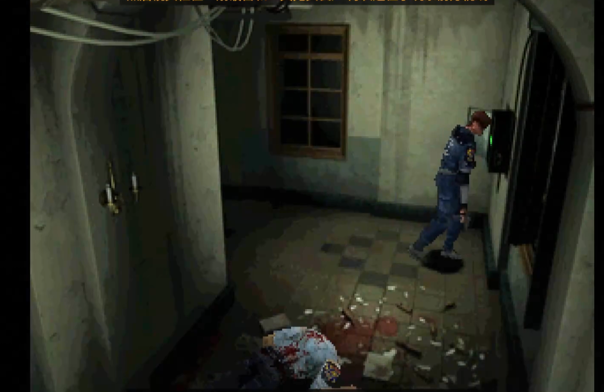
随后镜头完美框住了地上的积血、碎落的天花瓷砖、破损的窗户
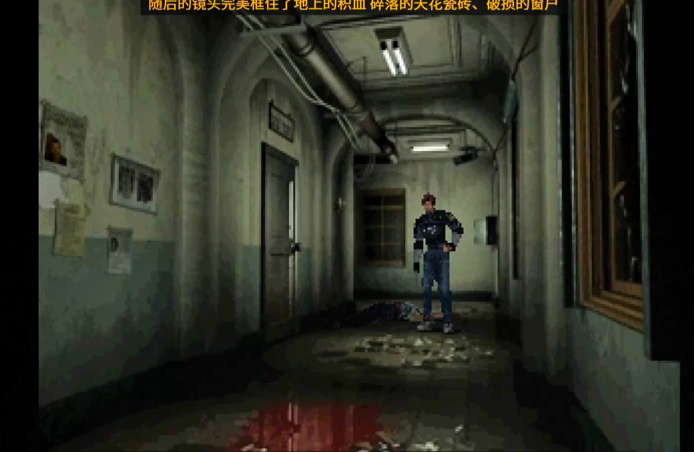
然后舔食者再出现在画面中。

但是最近的趋势是让镜头紧随角色后方，以营造亲近感
“**我们想呈现感同身受的恐怖，仿佛是你自己与丧尸近身遭遇，我想只有那种视角才能办到**”
所以尽管舔食者没有惊艳的登场了，但另一方面被丧尸偷袭的感觉确实更惊心动魄了。
2013的《古墓丽影》中那种抖动的贴身镜头，让玩家体会劳拉的挣扎，镜头紧随劳拉的动作，迫使玩家共同面对，比如水淹的密室，爬上无线电塔。镜头甚至有专门的物理效果，会随着劳拉的磕磕碰碰而摇晃，动画师也让劳拉一有机会就望向镜头，让劳拉惊恐的表情一览无余。
上述这些令人感同身受的效果，是广视角无法企及的。
但哪怕越近的镜头越显得亲近，无可否认的是，你离角色越近，你的外围视野越小，玩家角色更占据了屏幕一大块
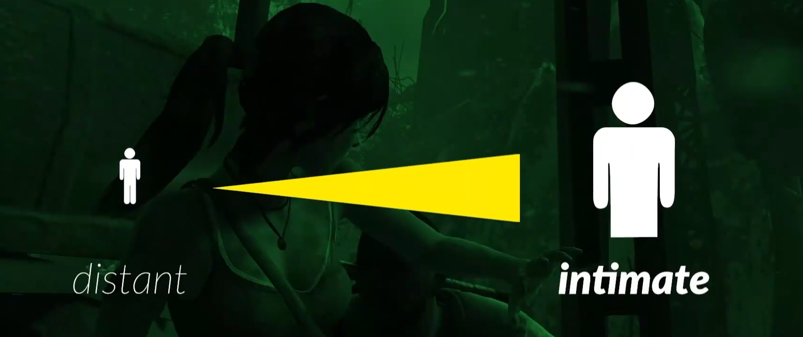

这对射击游戏问题不大，因为是否能瞄准远处目标，要比看清两侧是什么更重要。所以越肩视角既让玩家享受第一人称的便利，又能让玩家看清角色，这有助于增强代入感，同时很好的支持越障和掩体机制。早期的《战神》系列将镜头拉远，以带来整个战场的广视角，这完美契合游戏的战斗系统：海量敌人，大弧度攻击，范围杀伤魔法。但奎爷很小，更像是操纵玩具和公仔而非扮演角色。反观PS4的《战神》镜头被拉近许多，一直跟在奎爷身后，这确实营造出更亲近角色的感觉，也让玩家体验奎爷视角。游戏旨在讲述一个更人性化的故事，所以这种镜头帮助良多。但战斗就没这么理想了，玩家要同时与许多敌人交锋，他们能在你有限的视角外悄悄靠近。另外挥斧子的时候，判读奎爷和敌人之间的距离并不直观。虽然镜头在扔斧子的时候模拟了第三人称射击游戏，但在常规战斗就不同了，镜头不仅会影响视野，还会影响游戏体验。老系列战神让我觉得自己所向披靡，但新战神却让我玩的谨慎以防被敌人绕后。
当然，贴身镜头也能适用于动作游戏，比如地狱之刃和黑暗之魂就让镜头紧随玩家，但那些游戏重在策略性操作和反应式玩法，而多数时候只需面对一个敌人，至于敌人成堆的游戏，比如鬼泣通常偏向广视角，这样整个战况才一目了然。新战神做了大量工作以确保战斗能适应新视角，比如箭头会指明屏幕外敌人的站位
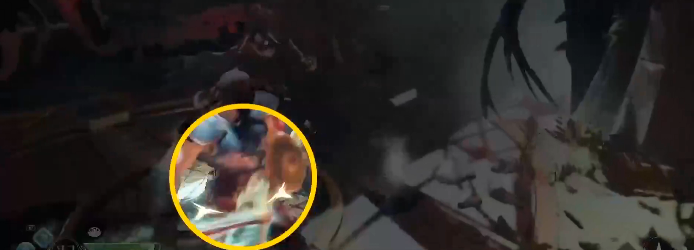
NPC也会不断警告身后威胁，同时屏幕外的敌人会变得不那么具有攻击性，这样玩家就可以专注对付眼前的那些。同时奎爷会用自动冲向攻击范围边缘的敌人，以缓解距离感知问题。游戏设置了最大高度防止敌人浮空飞出屏幕外。开发者还加了锁定键，正如其他动作游戏那样，但这似乎舍近求远了。
# 动态镜头
因为，镜头显然可以在游玩时变化，大多数第三人称射击游戏会在瞄准时放大镜头，让你更好的观察目标，微调准星。镜头也能缩小，在蜘蛛侠中，蛛丝摆荡时，蜘蛛侠会变成屏幕中央的一个小不点，以便让玩家尽可能看清楚要去的地方。碰射滑行时，《征服》的镜头会稍稍后仰，以增强速度感。《战神》也不例外，镜头会在扔斧子时放大，在奔跑时缩小。但实际开发者能让镜头更大幅度变化以适应当前场景。在蝙蝠侠阿卡姆疯人院中，当玩家漫步在走廊时，镜头会紧贴蝙蝠侠后背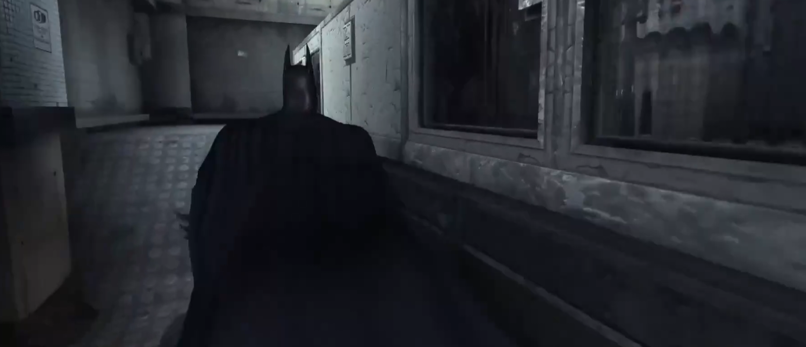
但当进入战斗，镜头会大幅度后啦，给玩家观察战况的更好视野，镜头会自动锁定并朝向你当前攻击的敌人。这可能会导致某些令人晕眩的大幅度视角摆动。
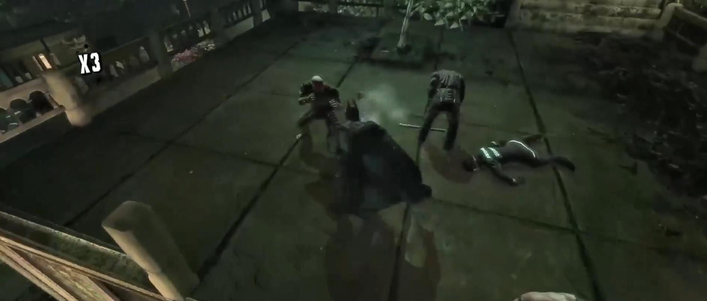但仍不失为呈现战斗，并突出画面重点的好办法。
《猎天使魔女》所见略同，不过它是尝试将镜头转为侧视图，临时呈现一个2D格斗视角，让玩家和敌人同处一框。
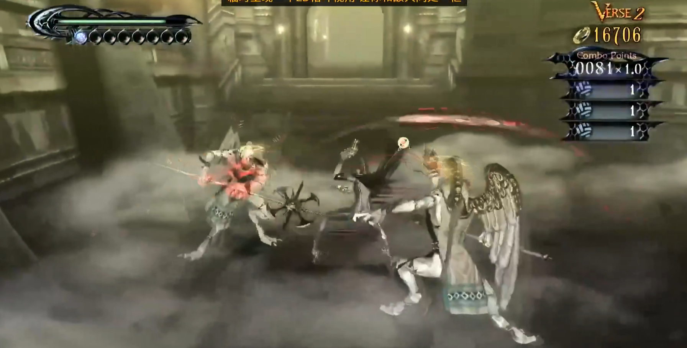
蝙蝠侠中当玩家蹲下时，游戏还知道要潜行了，于是镜头稍稍向后，给玩家更好的外围视野洞察威胁。
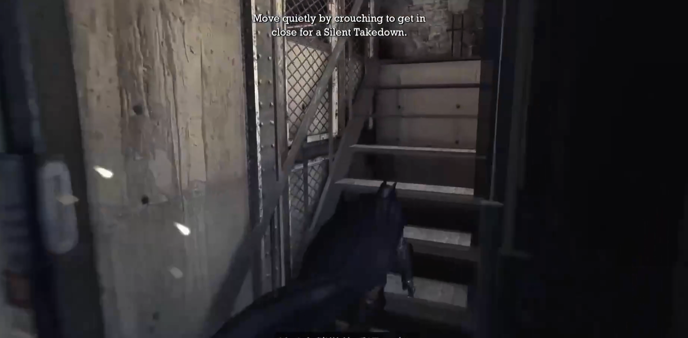
当玩家藏身掩体时，游戏会给玩家转角处的固定镜头。
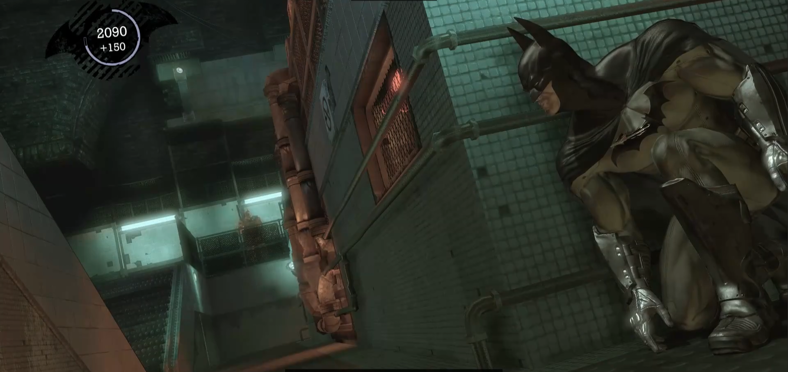
当玩家爬上石像时，视野会大大拓宽
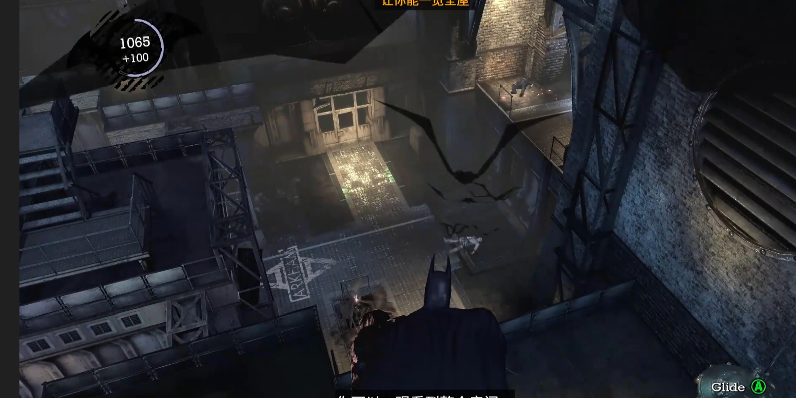
进入通风管时，游戏会切成第一人称视角

当陷入某些稻草人幻觉时，游戏甚至会变成2D横版，让玩家专注平台跳跃
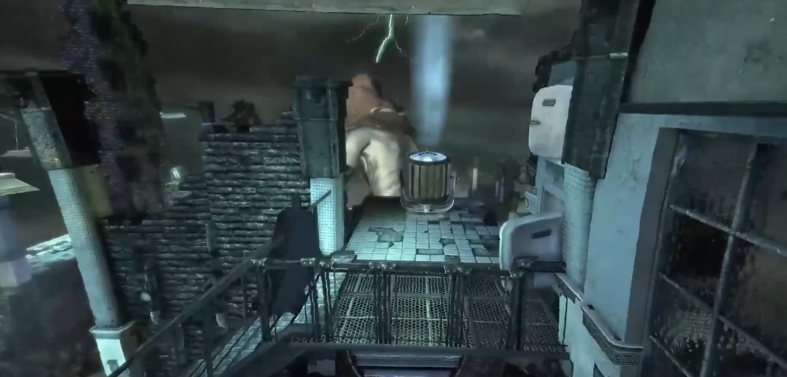
当中了稻草人的毒，游戏会呈现斜角镜头，表现蝙蝠侠失去了平衡
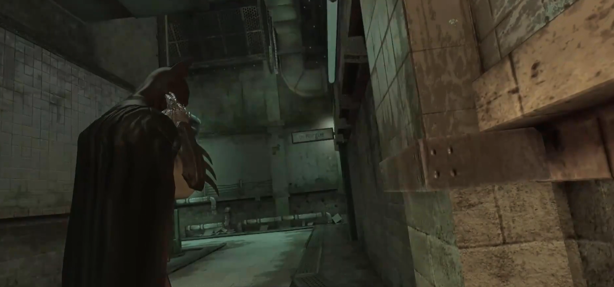
**在这种复杂且多面的3D游戏中，总会涉及各类镜头需求，所以不会尝试制作一个，而是让镜头偏移变换以适应各种玩法**
玩家仍感觉自己是蝙蝠侠，因为大多数时候镜头紧随身后，但它会在需要时向后拉，给玩家更好的外围视野。战神也可以做类似的事情，镜头在探索时越肩，遇敌时则向后拉出更宽广的视角，甚至无需换镜，依然能保持一镜到底。
**精彩正是诞生于开发者超越自我时，诞生于特定情况下打破教条的一刻**
## 1 说到底，镜头是非常强大的工具，但最重要的一点是尽管镜头设计的确能实现美感和电影学，但如果损害了游戏的实际体验，那就只会令人沮丧不已。归根结底，镜头设计要服务于玩法，而非玩法适应镜头。