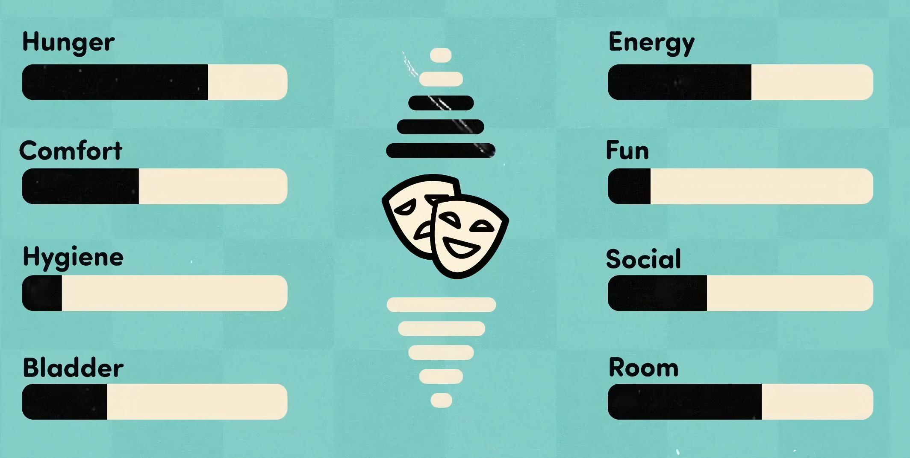
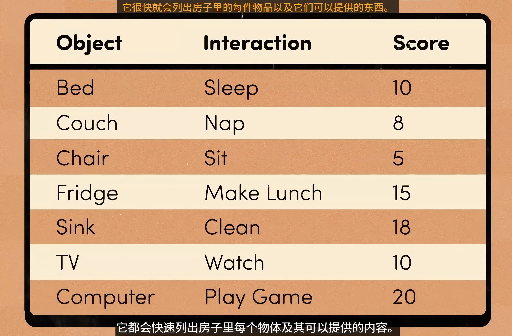
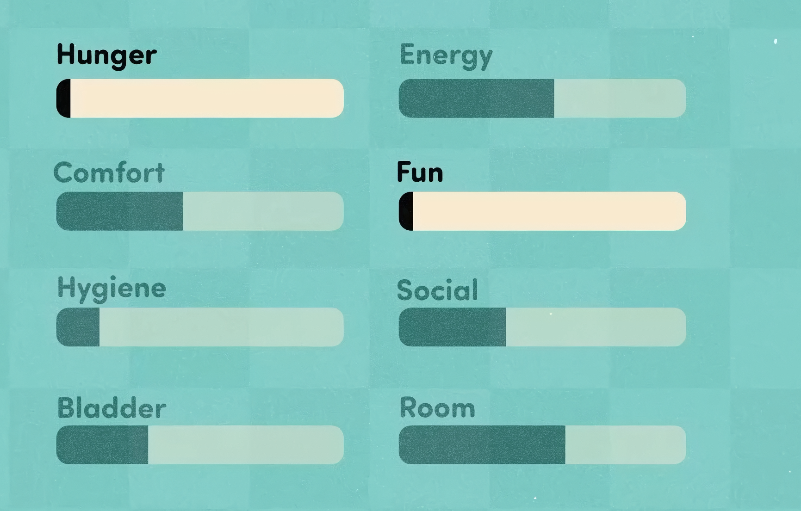
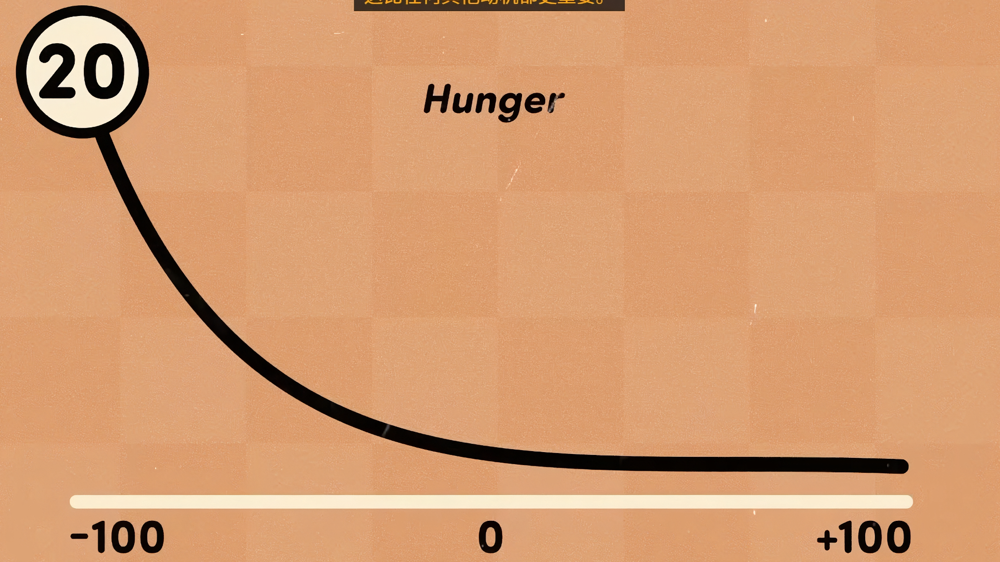
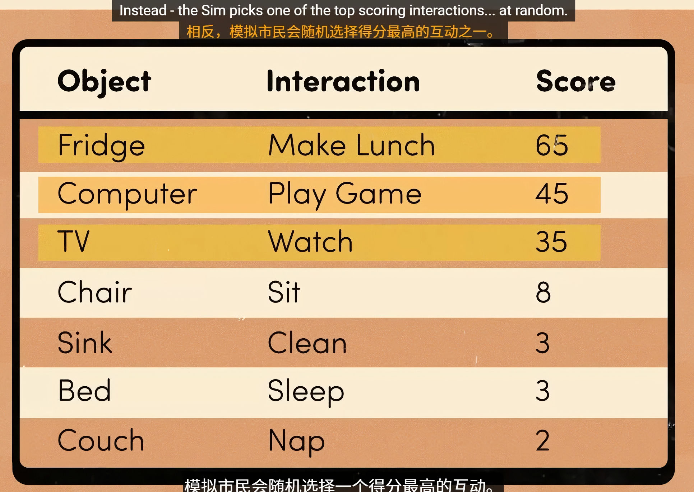
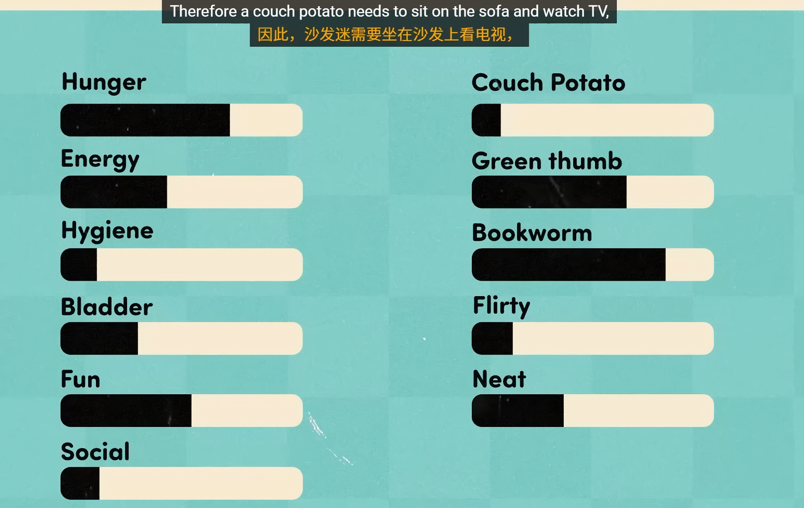

模拟市民的决策取决于一组身心需求-动机
从-100~+100

通过结合起来得到幸福度

仪表都会下降，每个仪表的衰减速度略有不同

如果模拟市民在执行相关的操作时，速度会更快

例如玩家在进食时，膀胱计量表下降的更快

通过调整速率与人类正常作息相匹配，八小时睡眠和一日三餐

模拟市民会自行驱动  

每个物体会广播他们所能提供的数值

每当市民决定做什么是会列出每件物品以及它们可以提供的数值

通过当前的动机水平对广播的分数相乘来实现  

睡眠良好分数低，精疲力竭分数高

同时核心需求大于生活需求

为每个需求定义独特的曲线来是吸纳理性的行为

如冰箱分数，在吃饱时几乎为0

然而生活需求会当模拟市民更快乐而增加

根据市民的玩乐水平判断权衡-个性

同时一些互动凌驾于一切之上，因此不会向其它来访者广播

会随机选择得分最高的之一实现随机性

实用AI-基于需求的AI

角色具有一组预定义的需求，然后查看当前的选项并选择最能满足需求的选项

此外，将信息放在物体上而不是模拟市民上可以添加DLC等其它物品而不用修改系统

个性->特质

与特质相关的动机

物品也会广播为解决特质相关动机的方案

添加额外动机也可以模拟社交情景（健身房-客人来访）动机可以只在健身房或来访时生效

特质不同会让市民出现异常-通过调整动机实现

编写规则集确定对话主题的结果（类似对象-具体的规则，可以堆叠）

城镇市民-

添加的市民为数值而服务：

男女当前比例决定生成的性别

就业率决定是否上岗或失业

午夜城镇都会检查幸福水平程度并采取行动来满足需求

地块也有各自需求和动机

如餐馆会午饭和晚饭需要8个人吃饭，在外面吃饭的动机吸引符合特质的市民前去

背景市民以低水平细节进行模拟，系统每天都会查看并评估重大生活变化-工作、恋爱、结婚（根据特质，现有关系和职业道路等因素加权）

通过图标预测当天的需求变化

当背景市民因为玩家靠近成为前景市民时，会根据当前时间与需求图表对应。

特别：

~~小便池规则-一个隔一个~~（被去除，太规律缺少乐趣性）

尴尬行为和难忘时刻

随机时刻！

谨慎的使用模糊性-如玩家通过无意义发言来对话

始终遵循玩家的引导-不使用自主权违背玩家试图讲述的故事（自动辞职或与随机市民恋爱）在玩家行为上构建避免违背玩家的行为即玩家让两个市民恋爱，自主系统不应该让他们再次分手。同样初始没有性取向，如果男性向其他男性调情即为暗示双性恋或同性恋，游戏会以此为基础进行下去。

游戏应该始终保持玩家故事的一致性!